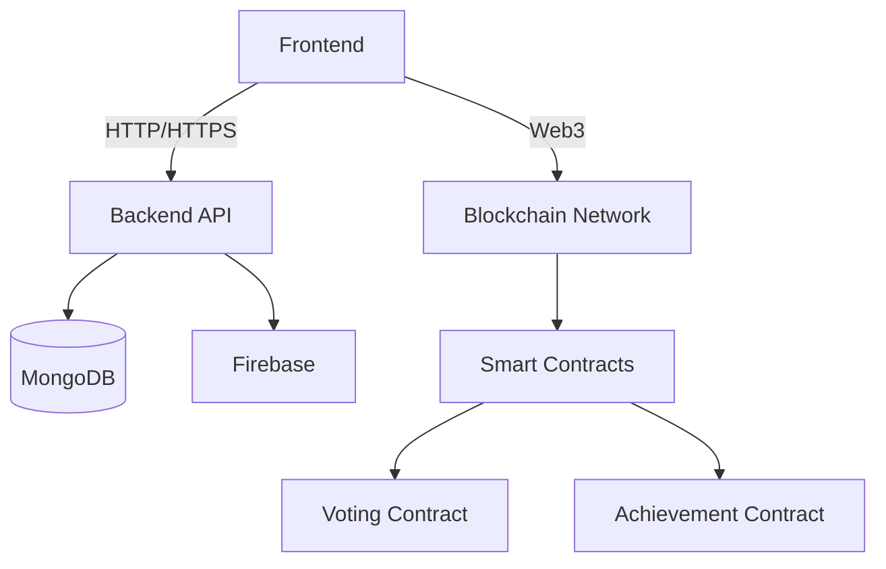
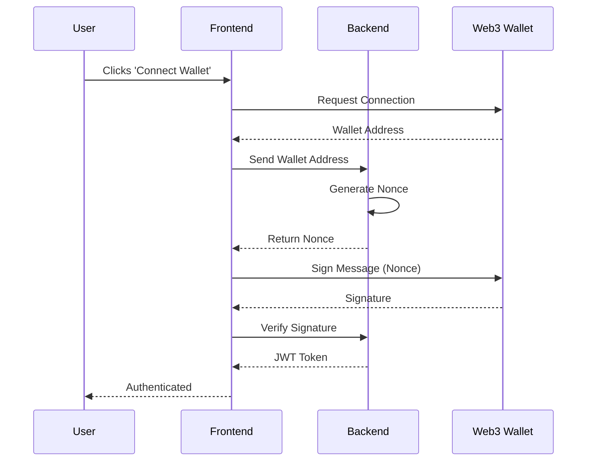
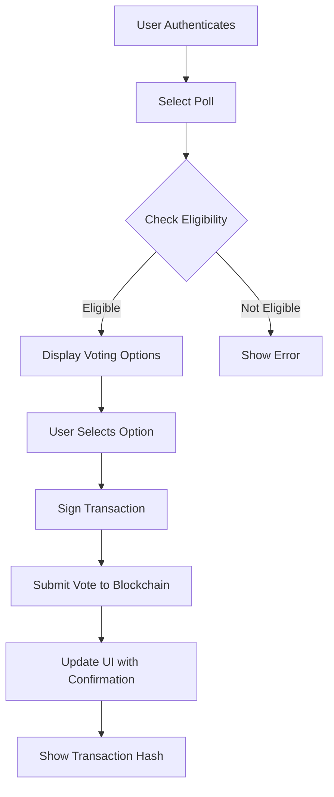

# Project Documentation: College Student Portal with Blockchain Integration

## Table of Contents
1. [Project Overview](#project-overview)
2. [Tech Stack](#tech-stack)
3. [Blockchain Integration](#blockchain-integration)
4. [System Architecture](#system-architecture)
5. [Workflow Diagrams](#workflow-diagrams)
6. [API Documentation](#api-documentation)
7. [Setup & Deployment](#setup--deployment)
8. [Testing](#testing)
9. [Troubleshooting](#troubleshooting)

## Project Overview

The College Student Portal is a comprehensive platform that facilitates student engagement, event management, and secure voting. With the integration of blockchain technology, we ensure transparency and immutability of critical operations like voting and achievement verification.

## Tech Stack

### Frontend
- React with TypeScript
- Vite
- Tailwind CSS
- Web3.js / ethers.js
- React Router
- Framer Motion
- Lucide Icons

### Backend
- Node.js with Express
- MongoDB (Mongoose ODM)
- Firebase (Authentication, Storage)
- Socket.IO (Real-time updates)

### Blockchain
- Ethereum / Polygon
- Solidity Smart Contracts
- Web3.js / ethers.js
- MetaMask Integration

### DevOps
- Docker
- PM2 (Process Manager)
- GitHub Actions (CI/CD)

## Blockchain Integration

### Smart Contracts

#### 1. Voting Contract
- Manages the voting process
- Tracks votes immutably
- Ensures one vote per user
- Provides transparent vote counting

#### 2. Achievement Contract
- Stores and verifies student achievements
- Issues verifiable credentials
- Maintains a tamper-proof record

### Key Features
1. **Secure Authentication**
   - Web3 wallet integration
   - Role-based access control

2. **Transparent Voting**
   - Immutable vote recording
   - Real-time results
   - Vote verification

3. **Achievement Tracking**
   - Blockchain-verified credentials
   - Shareable achievements
   - Tamper-proof records

## System Architecture



## Workflow Diagrams

### User Authentication Flow


### Voting Process Flow


## API Documentation

### Authentication
- `POST /api/auth/nonce` - Get nonce for wallet
- `POST /api/auth/verify` - Verify signature and get JWT

### Voting
- `GET /api/polls` - Get all active polls
- `POST /api/vote` - Submit a vote (signed transaction)
- `GET /api/votes/:pollId` - Get vote count for a poll

### Achievements
- `POST /api/achievements/issue` - Issue new achievement
- `GET /api/achievements/:wallet` - Get achievements by wallet
- `GET /api/achievements/verify/:id` - Verify achievement

## Setup & Deployment

### Prerequisites
- Node.js v16+
- MongoDB
- MetaMask browser extension
- Git

### Installation

1. Clone the repository
   ```bash
   git clone <repository-url>
   cd project
   ```

2. Install dependencies
   ```bash
   # Install root dependencies
   npm install
   
   # Install server dependencies
   cd server
   npm install
   
   # Install client dependencies
   cd ../client
   npm install
   ```

3. Configure environment variables
   - Copy `.env.example` to `.env`
   - Update with your configuration

4. Start development servers
   ```bash
   # Start backend
   cd server
   npm run dev
   
   # Start frontend (in a new terminal)
   cd ../client
   npm run dev
   ```

## Testing

### Unit Tests
```bash
# Run client tests
cd client
npm test

# Run server tests
cd ../server
npm test
```

### Smart Contract Tests
```bash
cd blockchain
npm test
```

## Troubleshooting

### Common Issues
1. **Wallet Connection Fails**
   - Ensure MetaMask is installed
   - Check network configuration
   - Verify contract addresses

2. **Transaction Fails**
   - Check gas fees
   - Verify wallet has sufficient funds
   - Check contract owner permissions

3. **API Connection Issues**
   - Verify backend server is running
   - Check CORS configuration
   - Verify JWT token is valid

## License

This project is licensed under the MIT License - see the [LICENSE](LICENSE) file for details.
